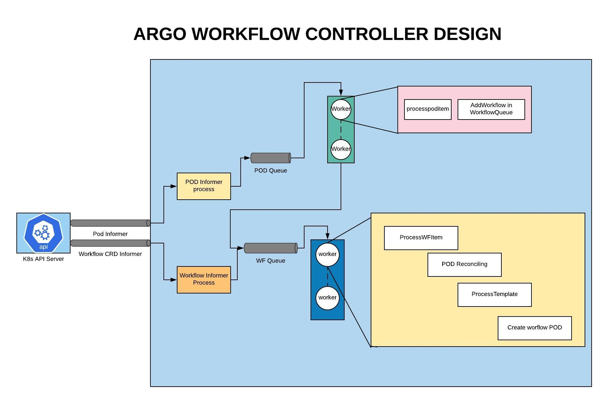

# Work Workflow Architecture

> v2.5 and after

From v2.5, you can run Work WF in two modes: "local" and "hosted". 

> v2.4 and before

## Work Workflow Overview

## Workflow controller architecture

